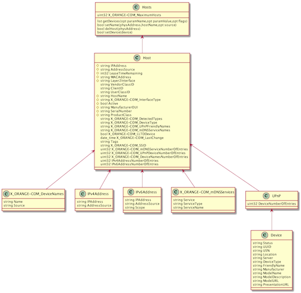
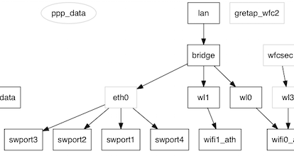
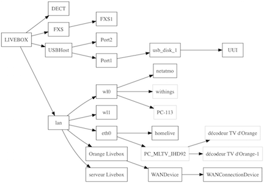

# sysbus.py

[🇫🇷 Original french version 🇫🇷](README.md)

`sysbus.py` is a Python 3 script that allows you to programmatically control a Livebox and explore control possibilities and other hidden information. It is an "experimental" tool.

There is - unfortunately - no crunchy hidden information to discover, or so I have not found anything. The Livebox is closed well enough.

## Installation

The script is written in [Python 3](https://www.python.org/downloads/). It also requires [requests](http://docs.python-requests.org/) which greatly simplifies HTTP requests. It may use [Graphviz](http://www.graphviz.org) and one of its Python interface modules [graphviz](https://pypi.python.org/pypi/graphviz) to draw graphs.

It will also install the Graphviz engine. On OSX we can use [brew](http://brew.sh). On Linux, `sudo apt-get install graphviz` or equivalent depending on the distribution.

This should work also with Windows. Refer to the sites of the various software for installation procedures.

## Configuration

Most requests require authentication. This is the user `admin` and the admin password (by default the first 8 characters of the Wi-Fi key).

The script stores the password (as well as the address of the Livebox and its version if you do not use the default values) in the `~ / .sysbusrc` file.

The version of the livebox defaults to `lb4` (Livebox 4) but can be replaced (` lb3` for example) after the `-lversion` argument.

To configure, type the following command (assuming that the password is SECRET):

    $ ./sysbus.py -config -password SECRET [-url http://192.168.1.1/] [-lversion lb4]

From now on, the script will use this login information each time. One can test by asking the time of the equipment:

    $ ./sysbus.py
    Livebox time: Sun, 14 Feb 2016 22:08:32 GMT + 0100

## Use

A certain number of requests are integrated in the script (like the request time, or Wi-Fi keys, devices present, etc.) with more or less formatting of the result.

The script is also able to send almost any request, provided that it is fully specified on the command line.

    $ ./sysbus.py Time: getTime
    Livebox time: Sun, 14 Feb 2016 22:13:30 GMT + 0100

The `-h` or` --help` option displays all the possible syntax.

## The sysbus interface

By browsing the sources made available by Orange [here](http://opensource.orange.com/), we can establish that the Liveboxes since version 2 use a middleware developed by [SoftAtHome](http://www.softathome.com) and a home datamodel engine named "pcb".

Unfortunately I have not found any Internet references to this proprietary technology, or it is embedded among all the [meanings(https://fr.wikipedia.org/wiki/PCB) of the acronym, including _Printed Circuit Board_ . Orange and his friend SoftAtHome therefore offer a treasure hunt and puzzles.

This internal datamodel communicates with the outside via an HTTP interface and JSON named "sysbus".

This interface is used by the administration interface [http: //livebox.home] or the apps [iOS](https://itunes.apple.com/en/app/ma-livebox/id445573616?mt=8) and [Android](https://play.google.com/store/apps/details?id=com.orange.mylivebox.fr&hl=en).

The principle is to send POST requests with a list of parameters in a JSON object, the return will be a JSON object containing the result of the request.

It is reasonable to think that this is also the way that Orange administers Liveboxes (activation of shared Wi-Fi, updates) and perhaps network and / or hardware diagnostics.

### Example with

PLC curl used by Livebox 4 (firmware SG40_sip-en-2.14.8.1_7.21.3.1), which works with Livebox 3 (with firmware SG30_sip-en-5.17.3.1 at least):

    $ curl -s -X POST -H "Content-Type: application / x-sah-ws-1-call + json" -d '{"service": "NMC", "method": "getWANStatus", "parameters" : {}} 'http: //192.168.1.

    $ curl -s -X POST -H "Content-Type: application / json" -d '{"parameters": {}}' http://192.168.1.1/sysbus/NMC:getWANStatus | jq.

Result:

    {
      "result": {
        "status": true,
        "data": {
          "LinkType": "ethernet",
          "LinkState": "up",
          "MACAddress": "3C: 81: D8: xx: yy: zz ",
          " Protocol ":" dhcp ",
          " ConnectionState ":" Bound ",
          " LastConnectionError ":" None ",
          " IPAddress ":" aa.bb.cc.dd ",
          " RemoteGateway ":"
      }
    }

[jq](https://stedolan.github.io/jq/) is a tool that allows, among other things, to
reformat the JSON.

Note: This request does not require authentication, unlike the time request.

### Examples with the script

    # query similar to the curl example above
    $ ./sysbus.py sysbus.NMC: getWANStatus

    # passing parameters
    $ ./sysbus.py sysbus.NMC.Wifi: set Enable = True Status = True

### Where to find the requests?

The script has a `-scan` option that more or less lists the method calls that are used by the administration web interface. It uses for that the agglomeration of javascript scripts of the Livebox. On the other hand, it will be necessary to search to know the possible parameters.

Modern browser debuggers are also able to view sent queries and their results.

Another way is to use [wireshark] (https://www.wireshark.org) or [tcpflow] (https://github.com/simsong/tcpflow) and perform the actions that you wish to script, either via web interface, either via the mobile app if you know how to capture the Wi-Fi smartphone or tablet.

Finally, the last source of information is the datamodel.

## The datamodel

The sysbus interface has an interesting feature: that of being able to discover the datamodel.

For this, the HTTP request to make is a GET on the name of the object. The returned JSON describes the model.

`sysbus.py` is able to make the return readable by detecting functions, parameters and object instances. Decoding, based solely on observation, may be incomplete.

    # queries the datamodel of the NMC.Wifi object
    $ ./sysbus.py NMC.Wifi -model

    ============================ =============== level 0
    OBJECT NAME: 'NMC.Wifi' (name: Wifi)
    function: startPairing (opt clientPIN)
    function: stopPairing ()
    function: startAutoChannelSelection ()
    function: getStats (out RxBytes, out TxBytes)
    function: get ()
    function: set (opt parameters)
    parameter: Enable: bool = 'True'
    parameter: Status: bool = 'True'
    parameter: ConfigurationMode: bool = 'True'

Launched without an object name, the program displays the datamodel, with access restrictions. However, sub-objects can be accessible, such as NeMo.Intf.data, while neither NeMo nor NeMo.Intf are accessible. There are also the objects NeMo.MIB. * Name * (NeMo.MIB.alias for example), but forbidden access.

The `-modeluml` option will create class diagrams with [plantuml](http://plantuml.com) (see example below).

The datamodel includes some elements of different TR of the Broadband Forum (see [TR-181](https://www.broadband-forum.org/cwmp/tr-181-2-10-0.html) for example). For example, the Device.Hosts object is very similar to the one found in the Livebox, plus extensions specific to Orange (X_ORANGE-COM_xxx).

In addition, the presence of a user 'cwmpd' (see the UserManagement object) with the unknown password tends to prove that the Livebox communicates using _CWMP_ (or [TR-069](https://en.wikipedia.org/wiki/TR-069)) with its management gateway on the Orange side.

### New Livebox 4

The LB4's web interface is much more advanced. The datamodel is essentially the same, with more objects.

There is also a description of methods via Json queries:

    curl -s http: //livebox.home/sdkut/apis/pcb/Time/getTime.json | jq.

## The NeMo.Intf graph

The interfaces and pseudo-interfaces are internally organized into graphs via _upper_ and _lower_ connections.

The `-graph` option in` sysbus.py` uses Graphviz to display the entire graph of the interfaces.

    $ ./sysbus.py -graph

In grayed out, the blocks that are inaccessible (they are discovered only thanks to the links _upper_ and _lower_). And in ellipse, blocks disabled.

The graph is displayed in SVG, which is used to zoom without loss. It can only be modified in the source of the script (change 'svg' to 'png' for example).

Each interface manages one or more MIBs. The list can be retrieved with the command:

    $ ./sysbus.py -MIBs show

The MIBs (_Management Information Base_) are apparently close to SNMP MIBs, but they are not - or they are proprietary MIBs and can not be accessed in SNMP. This is the MIB named `base` which is exploited to build the graph.

    $ ./sysbus.py NeMo.Intf.wl1: getMIBs mibs = base traverse = this
    {'status': {'base': {'wl1': {'Enable': True,
                                 ' Flags': 'wlanvap penable netdev enabled '
                                          'wlanvap-bound wlansta netdev-bound'
                                          'inbridge netdev-up' ',
                                 ' LLIntf ': {' wifi1_ath ': {' Name ':' wifi1_ath '}},
                                 ' Name ':' wl1 ',
                                 ' Status': True ,
                                 'ULIntf': {'bridge': {'Name': 'bridge'}}}}}}

The interpretation of the result of this query is:

- the `wl1` object has the` base` MIB
- the properties of the base MIB are: `Name`` LLIntf` `ULIntf`` Status` `Enable`` Flags`
- this MIB describes the graph,`wl1` being connected by a _upper_ link to the` bridge` interface and a _lower_ link to `wifi1_ath`
- the interface is activated (`Status`)

The command is also able to establish a cross-tab between MIBs and interface to find the use. See this [result] (docs / MIBs.md) where X = used, 0 = referenced but empty.

    $ ./sysbus.py -MIBs table [html]

**Remarks:**

- The graph is perhaps incomplete since we only know the connections accessible blocks: we can not know the connections between two inaccessible blocks.
- By the way, the two blocks starting with `data` and` lan` seem separate, both being at the top of two separate graphs (at least if shared Wi-Fi is not enabled). Yet the flow of data necessarily passes from one graph to another. `data` is connected to` eth1` which the external connection, to the fiber box, `lan` is connected to Wi-Fi and` eth0` which represents the switch 4 ports of the local network.
- It remains undoubtedly to discover other information disseminated in these MIBs.

## The network topology

The Livebox is more or less able to display the [network topology](http://livebox.home/supportMapper.html) from its admin page. This information is stored in the datamodel, and it has more details than the web interface wants to display.

In particular, peripherals connected in Wi-Fi 2.4GHz (interface wl0) and those connected in 5GHz (interface wl1).

`sysbus.py` must be started with the` -topo` option to get this graph. Depending on the number of devices, the graph is very big. Adding `simple` the program only displays the device names.

We also see USB ports and UPnP.

    $ ./sysbus.py -topo simple

